# 🔄 Flujo de Datos del AI Service - LanguageAI

## 📊 Flujo de Datos Principal

### 1. Flujo Completo de Generación de Contenido

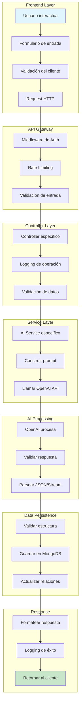

---

## 🧠 Arquitectura de Prompts del AI Service

### 2. Estructura de Prompts del Sistema

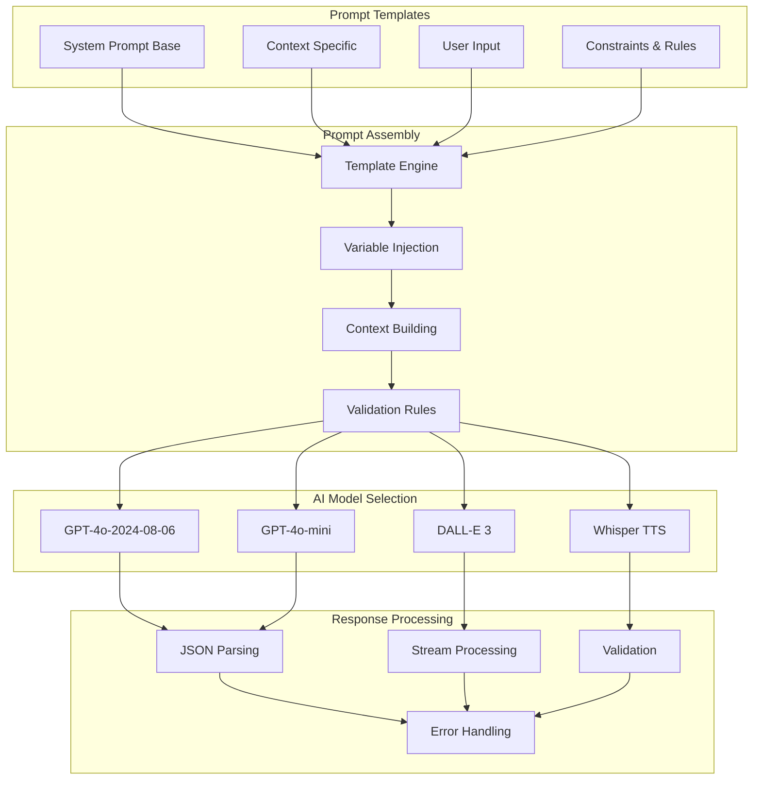

---

## 🔄 Flujo de Streaming y Respuestas en Tiempo Real

### 3. Sistema de Streaming del Chat

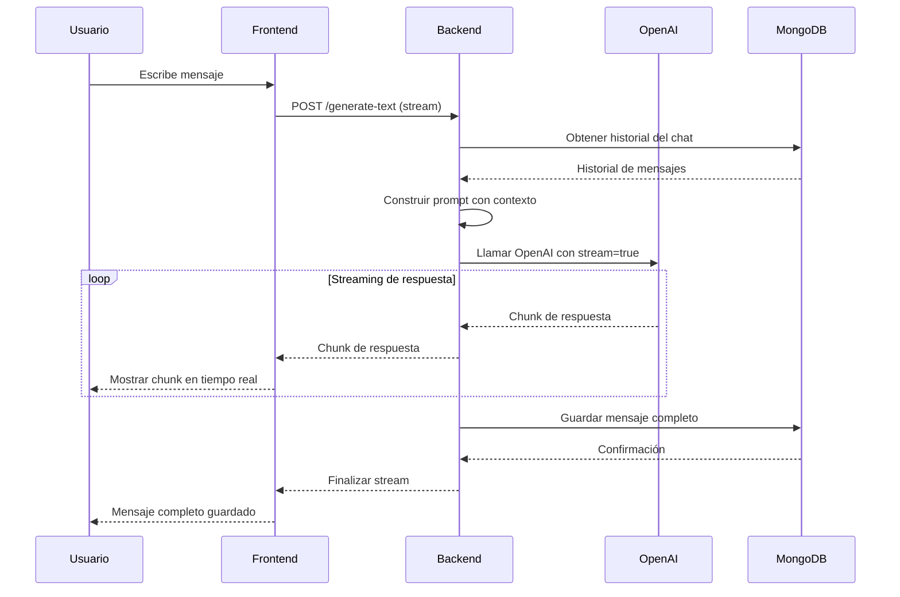

---

## 📝 Flujo de Generación de Exámenes Detallado

### 4. Pipeline de Generación de Exámenes

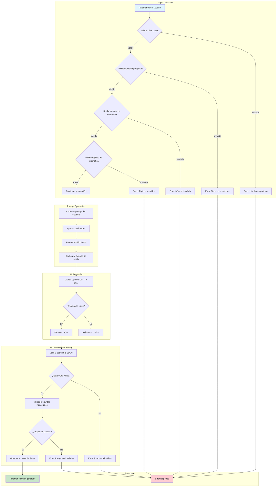

---

## 🖼️ Flujo de Generación de Imágenes

### 5. Pipeline de Generación de Imágenes

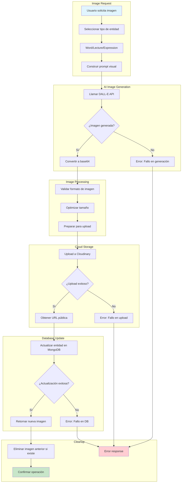

---

## 🔊 Flujo de Generación de Audio

### 6. Pipeline de Text-to-Speech

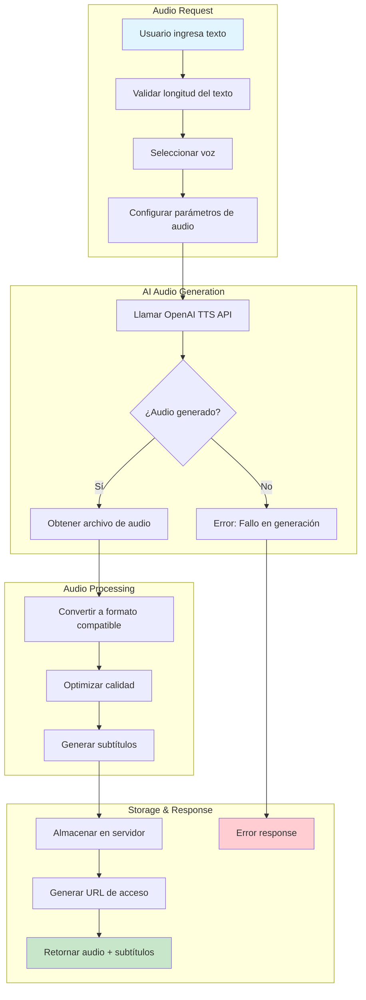

---

## 🔄 Flujo de Traducción

### 7. Pipeline de Traducción

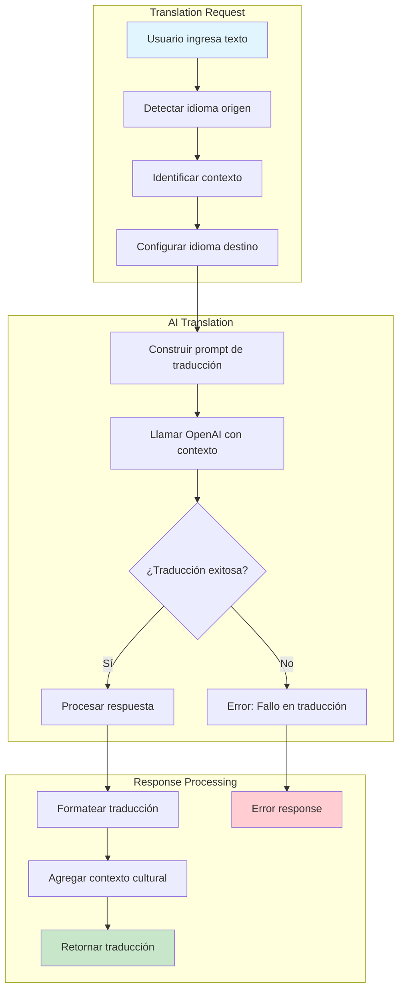

---

## 🗄️ Flujo de Persistencia de Datos

### 8. Pipeline de Base de Datos

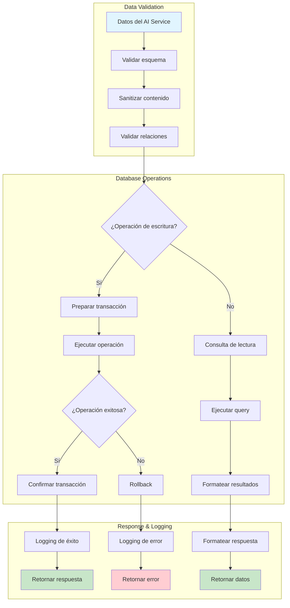

---

## 🔐 Flujo de Seguridad y Autenticación

### 9. Pipeline de Seguridad

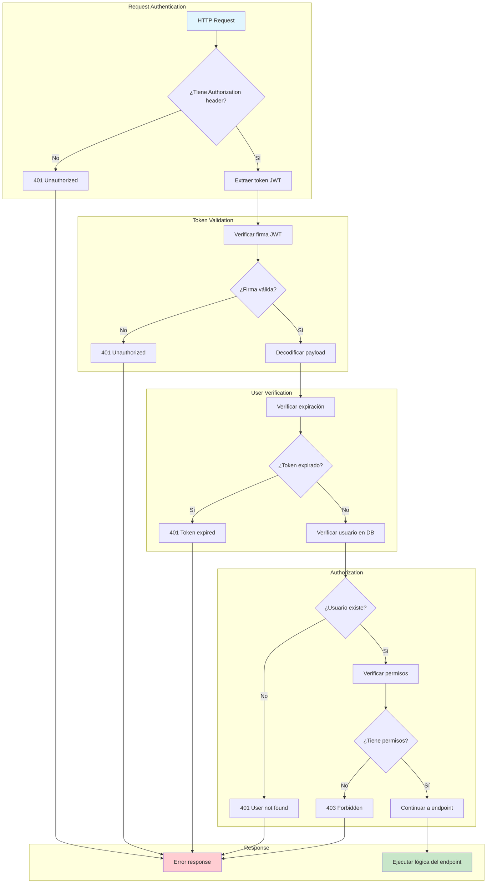

---

## 📊 Flujo de Logging y Monitoreo

### 10. Pipeline de Logging

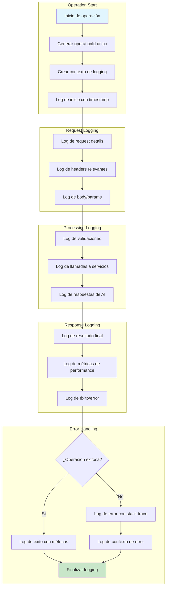

---

## 🚀 Flujo de Optimización y Caching

### 11. Pipeline de Caching

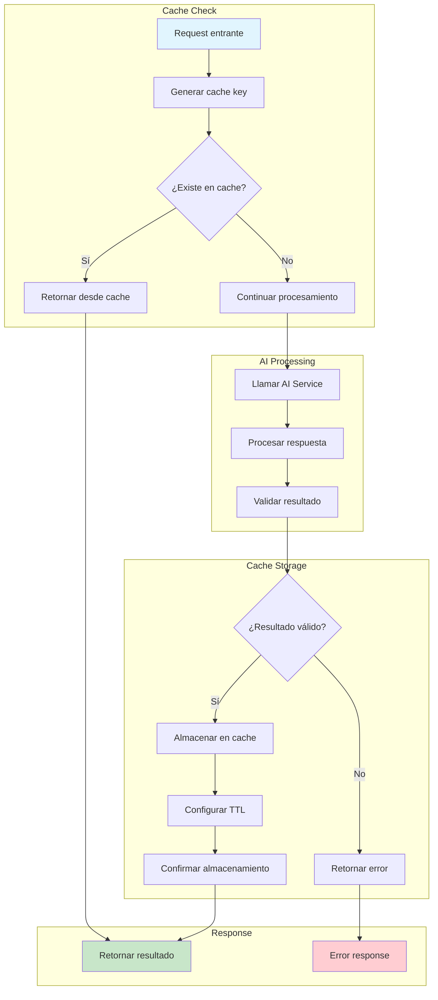

---

## 📈 Métricas y KPIs del Sistema

### 12. Dashboard de Métricas

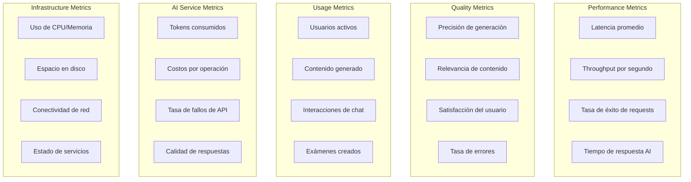

---

## 🔧 Configuración del Sistema

### 13. Variables de Entorno y Configuración

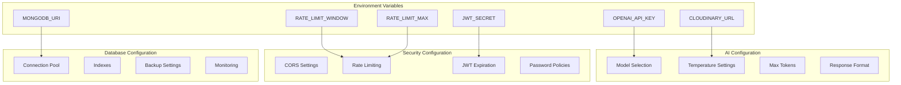

---

## 🎯 Resumen de Flujos Clave

1. **Generación de Contenido**: Input → Validación → AI Service → Validación → Persistencia → Response
2. **Chat Streaming**: Mensaje → Contexto → AI Stream → Frontend Stream → Persistencia
3. **Generación de Exámenes**: Parámetros → Prompt → AI → Validación JSON → Estructura → DB
4. **Imágenes**: Solicitud → Prompt → DALL-E → Base64 → Cloudinary → DB Update
5. **Audio**: Texto → TTS → Audio → Almacenamiento → URL Response
6. **Traducción**: Texto → Contexto → AI → Respuesta → Formateo
7. **Seguridad**: Request → JWT → Validación → Permisos → Endpoint
8. **Logging**: Inicio → Contexto → Procesamiento → Resultado → Métricas
9. **Caching**: Check → AI → Store → Response
10. **Métricas**: Performance → Calidad → Uso → AI → Infraestructura

---

## 🔮 Optimizaciones Futuras

- **Cache Distribuido**: Implementar Redis para cache compartido entre instancias
- **Queue System**: Colas para procesamiento asíncrono de tareas pesadas
- **Load Balancing**: Distribución de carga entre múltiples instancias del AI service
- **Circuit Breaker**: Patrón para manejar fallos de servicios externos
- **Retry Logic**: Lógica de reintento inteligente para fallos temporales
- **Compression**: Compresión de respuestas para mejorar performance
- **CDN**: Distribución de contenido estático para mejor velocidad
- **Monitoring**: Sistema de alertas y dashboards en tiempo real
