# 🔄 Diagramas de Flujo - AI Service LanguageAI

## 📋 Resumen Ejecutivo

El sistema LanguageAI utiliza múltiples servicios de IA para generar contenido educativo, incluyendo:
- **Generación de palabras y expresiones** con definiciones, ejemplos y traducciones
- **Chat interactivo** para aprendizaje de idiomas
- **Generación de exámenes** personalizados por nivel CEFR
- **Generación de imágenes** para contenido visual
- **Generación de audio** para pronunciación
- **Traducción en tiempo real**

---

## 🏗️ Arquitectura General del Sistema

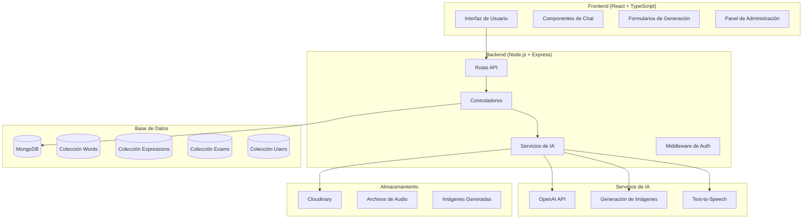

---

## 🔄 Flujo Principal de Generación de Contenido

### 1. Generación de Palabras (Words)

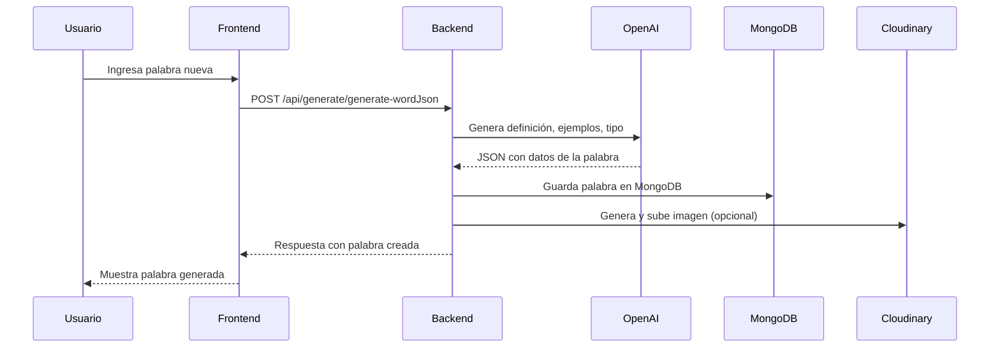

### 2. Generación de Expresiones

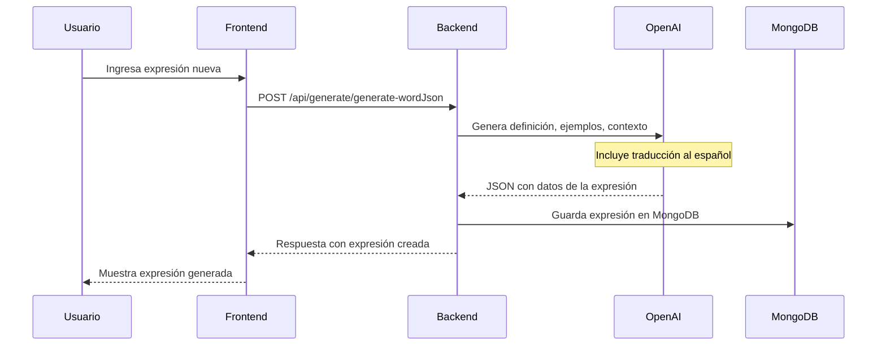

---

## 💬 Flujo del Sistema de Chat

### 3. Chat con Palabras/Expresiones

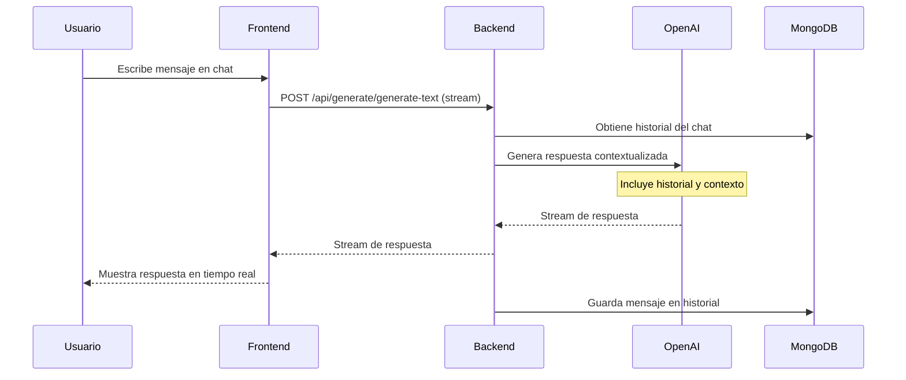

---

## 📝 Flujo de Generación de Exámenes

### 4. Generación de Exámenes Personalizados

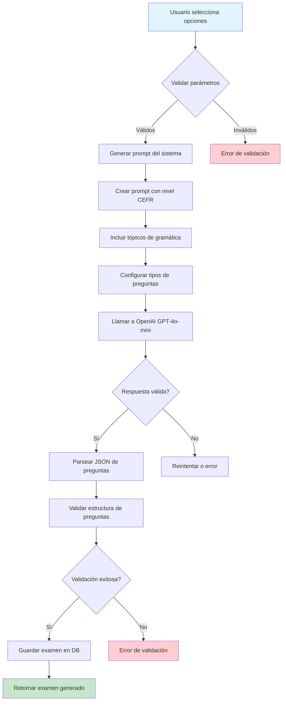

### 5. Detalles del Prompt de Examen

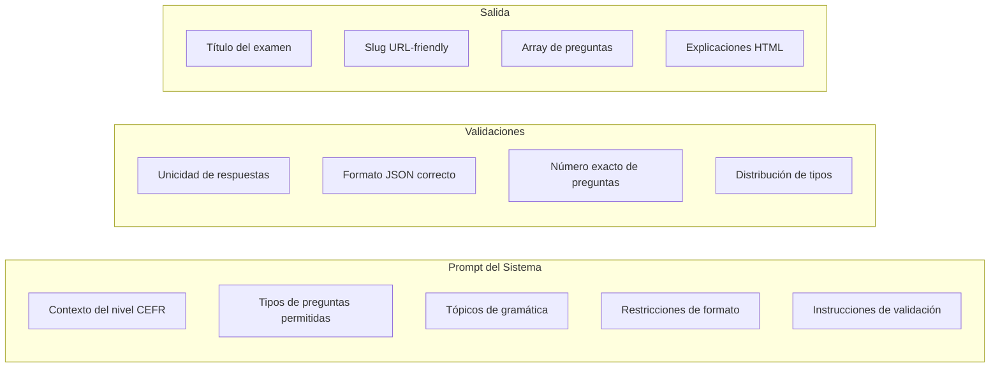

---

## 🖼️ Flujo de Generación de Imágenes

### 6. Generación y Almacenamiento de Imágenes

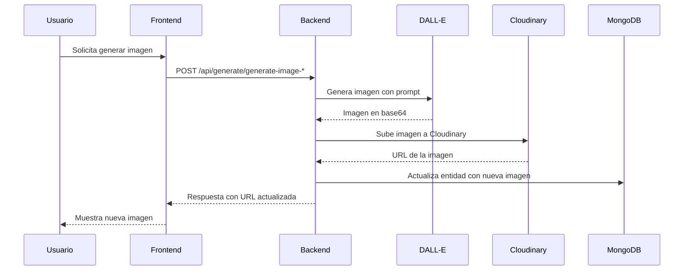

---

## 🔊 Flujo de Generación de Audio

### 7. Text-to-Speech

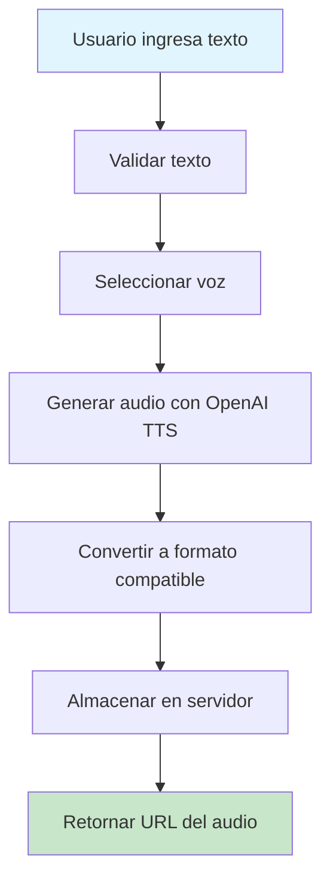

---

## 🔄 Flujo de Traducción

### 8. Traducción en Tiempo Real

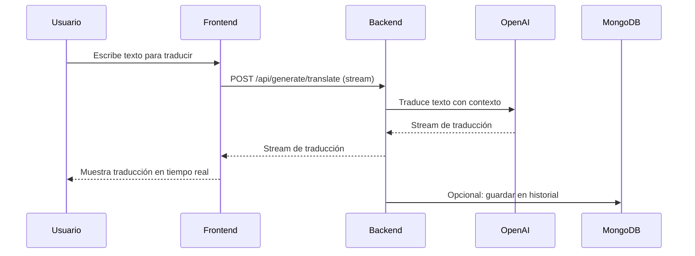

---

## 🗄️ Estructura de Base de Datos

### 9. Modelos de Datos

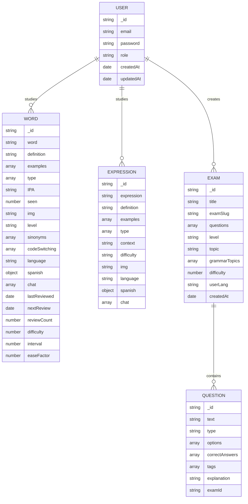

---

## 🔐 Flujo de Autenticación y Autorización

### 10. Middleware de Seguridad

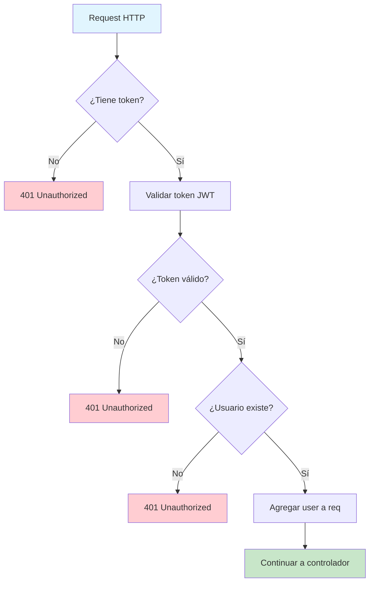

---

## 📊 Flujo de Logging y Monitoreo

### 11. Sistema de Logging Estructurado

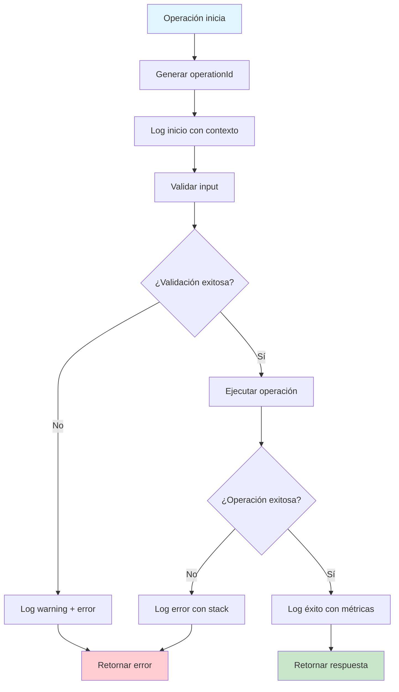

---

## 🚀 Optimizaciones y Mejores Prácticas

### 12. Estrategias de Rendimiento

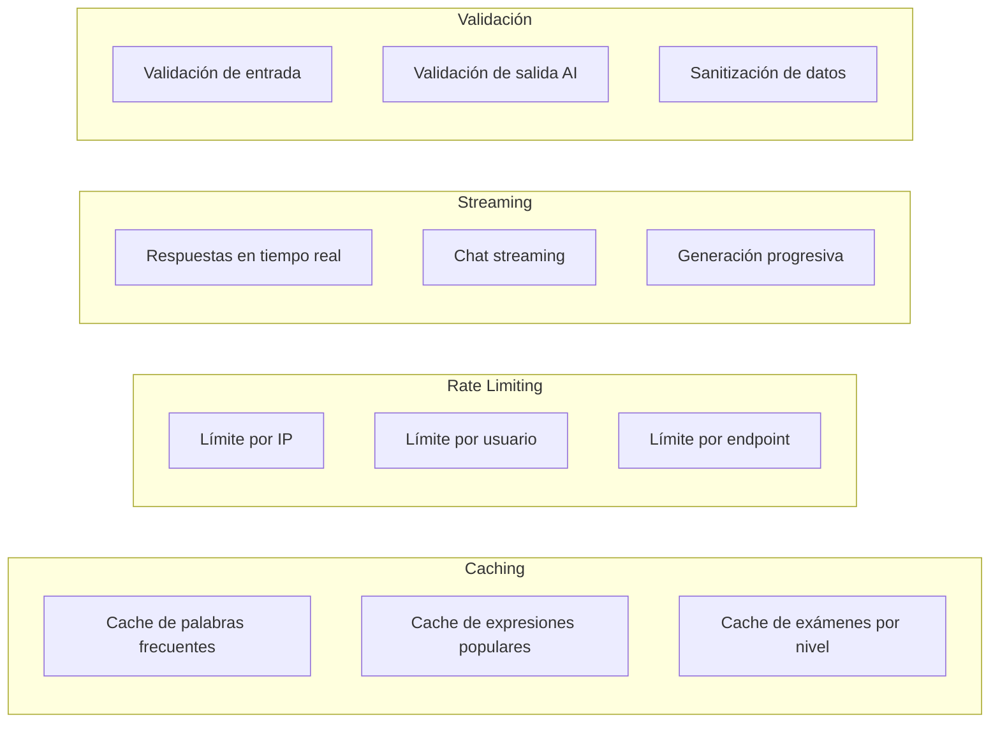

---

## 🔧 Configuración y Variables de Entorno

### 13. Configuración del Sistema

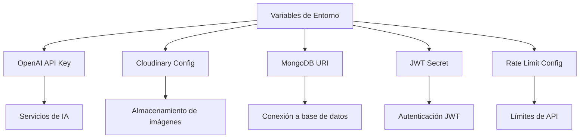

---

## 📈 Métricas y Monitoreo

### 14. KPIs del Sistema

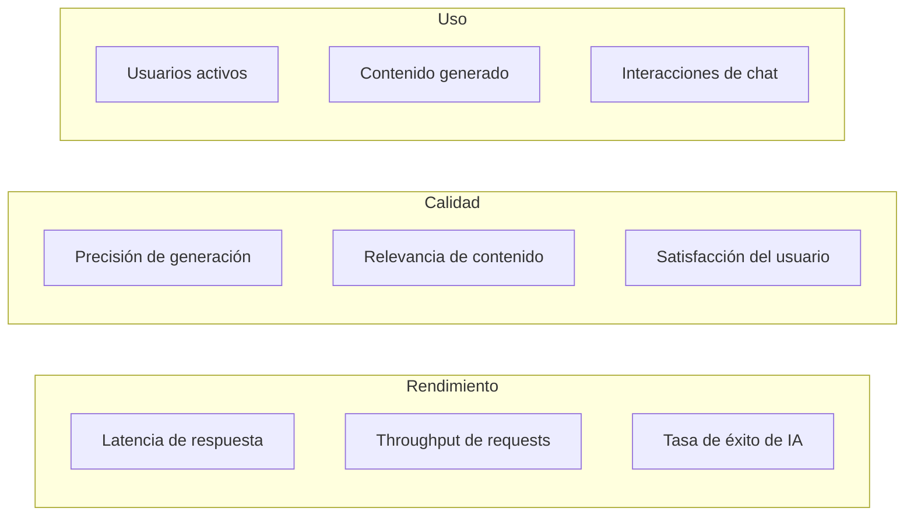

---

## 🎯 Puntos Clave del Sistema

1. **Arquitectura Modular**: Separación clara entre controladores, servicios y rutas
2. **Streaming en Tiempo Real**: Chat y generación de contenido con respuesta inmediata
3. **Validación Robusta**: Múltiples capas de validación para entrada y salida
4. **Logging Estructurado**: Sistema completo de monitoreo y debugging
5. **Manejo de Errores**: Gestión consistente de errores con códigos específicos
6. **Seguridad**: Autenticación JWT y validación de permisos
7. **Escalabilidad**: Diseño preparado para crecimiento y optimización
8. **Integración AI**: Múltiples servicios de OpenAI para diferentes funcionalidades

---

## 🔮 Futuras Mejoras

- **Cache Inteligente**: Implementar Redis para cache distribuido
- **Microservicios**: Separar servicios de IA en contenedores independientes
- **ML Pipeline**: Pipeline de machine learning para mejorar calidad de contenido
- **Analytics Avanzado**: Métricas detalladas de uso y aprendizaje
- **A/B Testing**: Sistema para probar diferentes prompts y configuraciones
- **Backup Automático**: Sistema de respaldo automático de contenido generado
